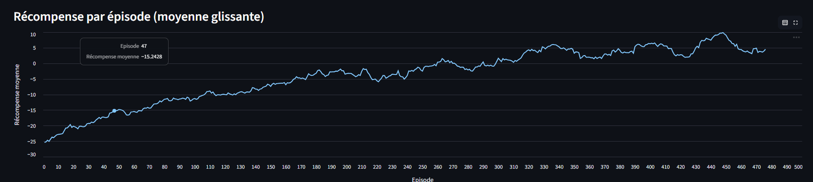
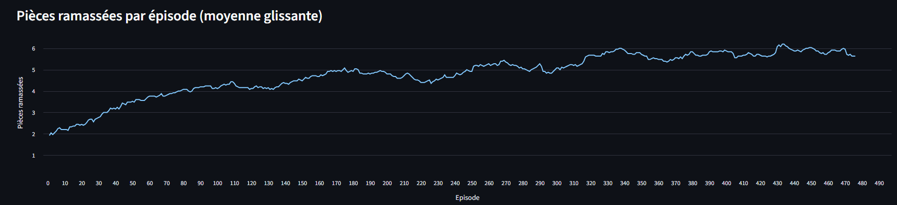

# Mini-Pacman – Q-Learning

Ce projet implémente un Mini-Pacman utilisant le Q-Learning dans un labyrinthe généré procéduralement.  
Une interface Web Streamlit permet d’entraîner l’agent, visualiser les résultats et lancer une démo animée.

---

# 1. Comment lancer le projet

## 1.1 Installer les dépendances

Dans un environnement Python propre :

```bash
pip install streamlit numpy pillow
``` 


## 1.2 Lancer l’interface Web

Dans le dossier du projet :

```streamlit run streamlit_app.py```

Cela ouvre automatiquement l’application dans le navigateur.

## 1.3 Utilisation de l’application

Onglet Training
- Configurer les hyperparamètres
- Lancer l'entraînement

Onglet Résultats
- Visualisation des courbes d’apprentissage

Onglet Démo
- Générer une partie
- Voir l’animation graphique image par image ou en lecture automatique


# 2. Modélisation RL
## 2.1 États
Un état est représenté par : 

```(px, py, fx, fy, coins_mask)```

px, py : position du Pacman
fx, fy : position du fantôme
coins_mask : bitmask indiquant quelles pièces restent

## 2.2 Actions

Actions possibles :

0 : haut
1 : bas
2 : gauche
3 : droite

Tentative contre un mur → Pacman ne bouge pas + pénalité.

### Fonction de récompense

| Événement                        | Récompense        |
|----------------------------------|--------------------|
| Ramasser une pièce               | +5                 |
| Toutes les pièces ramassées      | +20                |
| Se faire attraper par le fantôme | –20                |
| Tenter de traverser un mur       | –0.5               |
| Ne pas se déplacer               | –0.2               |
| Coût par pas                     | –0.1               |
| Revisite excessive d’un état     | –0.01 × visites    |


### Hyperparamètres utilisés

| Paramètre               | Valeur |
|-------------------------|--------|
| Learning rate (alpha)   | 0.1    |
| Discount (gamma)        | 0.99   |
| Epsilon initial         | 1.0    |
| Epsilon min             | 0.05   |
| Epsilon decay           | 0.995  |
| Nombre d’épisodes       | 5000   |
| Max steps par épisode   | 1000   |


# 4. Analyse des résultats 
   
Les deux graphiques montrent une progression régulière du comportement de l’agent au fil des 5 000 épisodes.

## 4.1 Récompense moyenne



La récompense commence autour de –25 et monte progressivement jusqu’à environ +10.
Cela indique que l’agent :

réduit fortement ses comportements pénalisants (collisions, immobilité),
apprend à éviter le fantôme,
optimise ses déplacements,
et maximise la collecte des pièces.

La courbe se stabilise après environ 3 000 épisodes, signe de convergence de la politique.

## 4.2 Pièces ramassées



Le nombre de pièces collectées passe d’environ 2 au début à 6 en fin d’entraînement.
Cela montre que :

l’agent identifie mieux les zones du labyrinthe contenant des pièces,
construit des trajets plus efficaces,
se déplace plus souvent dans des chemins sûrs loin du fantôme.

Le plateau final montre que l’agent ramasse presque toutes les pièces disponibles.


# 5. Limites

Q-Learning tabulaire → pas de généralisation, convergence lente.

Espace d’états large (positions + bitmask).

Fantôme simpliste (déplacement aléatoire).

Pas de planification à long terme.

# 6. Améliorations possibles

Passer en DQN (approximation par réseau neuronal).
Fantômes plus intelligents (poursuite, multi-fantômes).
Ajouter vision locale + distances (état plus riche).
Améliorer les récompenses (bonus pour se rapprocher des pièces).
Changer de labyrinthe à chaque épisode (meilleure généralisation).